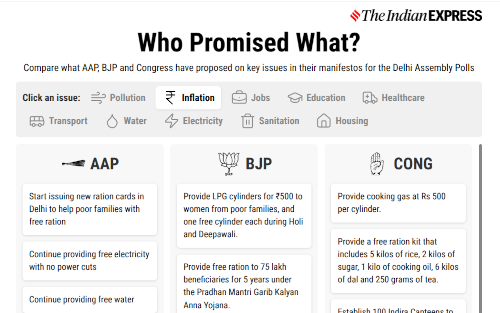

## About the repo
Collecting code and docs here related to some work on party manifestos for Delhi assembly elections in 2025.

The code here essentially generates a comparison of the various manifestos using Google's Gemini AI. 

So this is an attempt to automate such work using AI and minimal human intervention.

The interactive based on this comparison can be seen on the [Express website](https://data.indianexpress.com/projects/manifesto-guide).

### To Reproduce Results 
You can use the python scripts in the [code](/code) folder to reproduce the results. 

First, you'll need to create an .env file at the root of the project with a 'GEMINI_API_KEY' variable. You can get an API key from Google's [AI Studio](https://aistudio.google.com/).

(You can do two requests per minute to the API if you're in the free tier, change `time.sleep` to `30` seconds to be in line with free tier rate limits.)

If you haven't already, install Google's package to access the Gemini API with `pip install google-genai` (You might need to `pip install python-dotenv` to access the 'GEMINI_API_KEY' in the .env file).

Then to extract the text from say the bjp pdf, you can run [extract_pdf.py](code/extract_pdf.py). The script run took around 15 minutes for the BJP manifesto.

(You'll have to change a variable in the function call `extract_pdf_content('2025', 'dl', 'bjp')` to  `extract_pdf_content('2025', 'dl', 'cong')` to get at the congress pdf. Or to 'aap' to get at the aam aadmi party pdf and so on.)

There's also a [pdf translation script](code/translate_pdf.py) in there to translate a hindi pdf into english markdown. Ultimately didn't need it because the parties released English versions of their manifestos, but prepared a script anyway to be on the safe side.

Then run the script [create_comparison.py](code/create_comparison.py) to combine the markdown files and create a summary comparison of the various party manifestos.

The script will compare the manifestos on these issues:
  1. Pollution
  2. Inflation & Cost of Living
  3. Employment & Job Creation
  4. Education
  5. Healthcare
  6. Public Transport & Traffic management
  7. Water Supply
  8. Electricity
  9. Waste management & Sanitation
  10. Women's Safety & Empowerment
  11. Business, Trade & Industry
  12. Corruption
  13. Housing
  14. Urban Infrastructure Development

So on each issue, you'll get upto 5 promises/pledges related to the issue made by each party.

The comparison created will be in [comparison_text.json](manifestos/comparison_text.json). So this is in a machine-readable json format, because I'll be using it for a widget. But you can take the json, feed it into chatgpt etc. to get it as human-readable text.

A last script [get_supporting_text.py](code/get_supporting_text.py) is something i created to help people out in newsrooms. What it does is for each promise in comparison_text.json, it gets the line the promise is made in from the manifesto. 

It makes it a little easier for someone else to manually verify what the AI has done. Since the points in comparison_text.json may be rewritten a bit, they might not be able to do a Ctrl+F in the manifesto to find the line. Also if they want to check things in the pdf itself, the pdf may not be searchable. This supporting text script makes things easier.

### Sources
* BJP manifesto [link](https://www.bjp.org/files/election-manifesto-documents/Delhi-Manifesto_25-01-2025_English_0.pdf)
* AAP ~~manifesto~~ Guarantee Card [Card in Hindi](https://aamaadmiparty.org/wp-content/uploads/2025/01/WhatsApp-Image-2025-01-27-at-3.38.03-PM-768x1086.jpeg), [Press Release](https://aamaadmiparty.org/press-release/arvind-kejriwal-announces-15-guarantees-for-delhi-says-confident-people-will-pick-jhaadu-over-anyone-else/)
* Congress manifesto [link](https://res.cloudinary.com/dkplc2mbj/image/upload/v1738163891/Manifesto_English_f981dc12cc.pdf)